**Installing the JBoss Developer Studio Plugin**

**Step 1: Download and install JBoss Studio**

- Download the latest JBoss Developer studio from:
http://www.jboss.org/products/devstudio/download

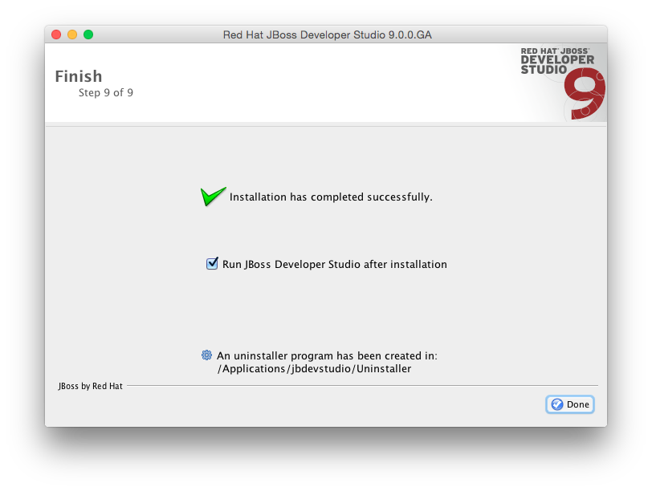

**Step 2: Install OpenShift Plugin**

- Open JBoss Studio.

- Navigate to JBoss Central and select "Software/Update" tab

- Look for the OpenShift v3 tools

- Select it and install. Accept license agreement. It may warn you about unsigned content. Ignore it.

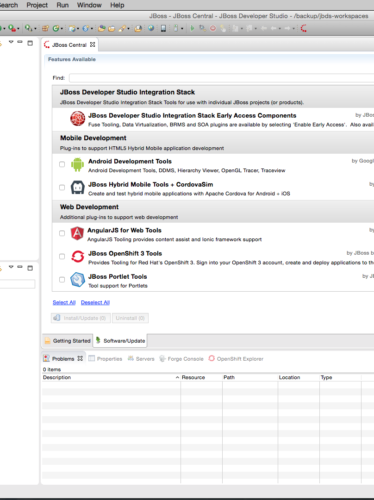

**Step 3: Configure OpenShift v3 Plugin**

- At the bottom of your IDE, expand the OpenShift explorer panel.

- Add a new connection.

- From the “Server type” dropdown box, select OpenShift 3.

- For the Server URL, ensure you add port 8443 if you are not using the default 
  server FQDN.

- Select the authentication mechanism.

- Provide the username and password.

- Click Finish

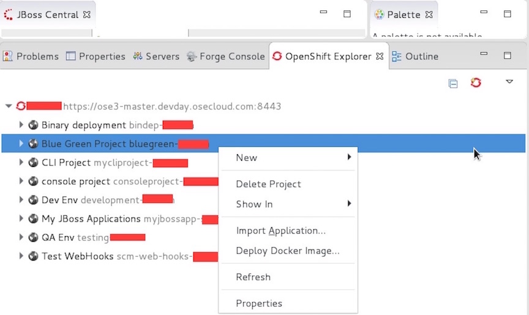
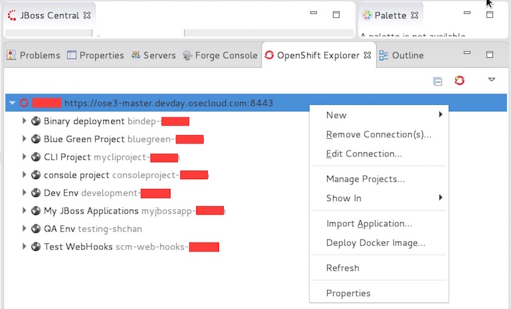

**Step 4: Verify your connection**

- At this point, you will be able to see any existing projects for which
the provider username and password have access to.

- You can also see a number of types, such as deployment configurations, services
routes, etc under OpenShift Explorer
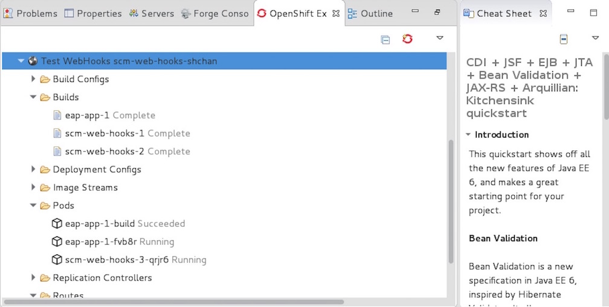

**Step 5: Create a OpenShift Application**

- Go to JBoss Studio, right click on the OpenShift connection --> select New --> select project
- Enter javatest as the new of the project.
- From the JBoss Studio menu, Select File --> New --> OpenShift Application 
- Make sure the information is correct and enter username and password 
- Click next.

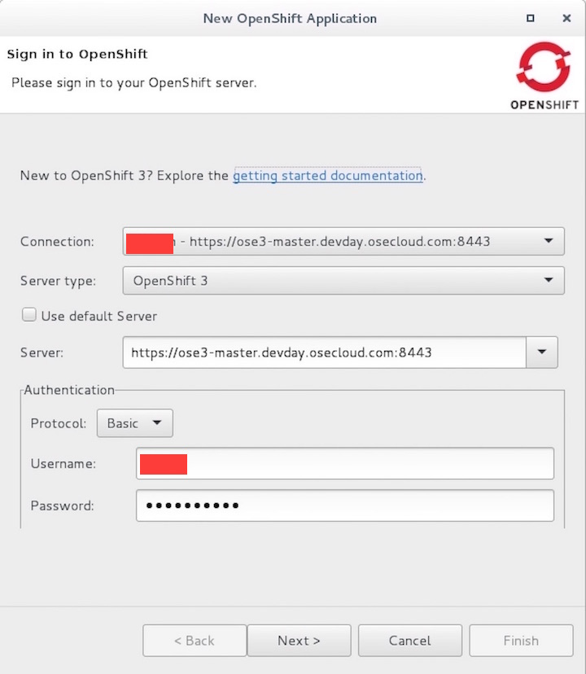

- Select the newly created project from the project dropdown list
- Select the eap64-basic-s2i template from the list
- Click Next

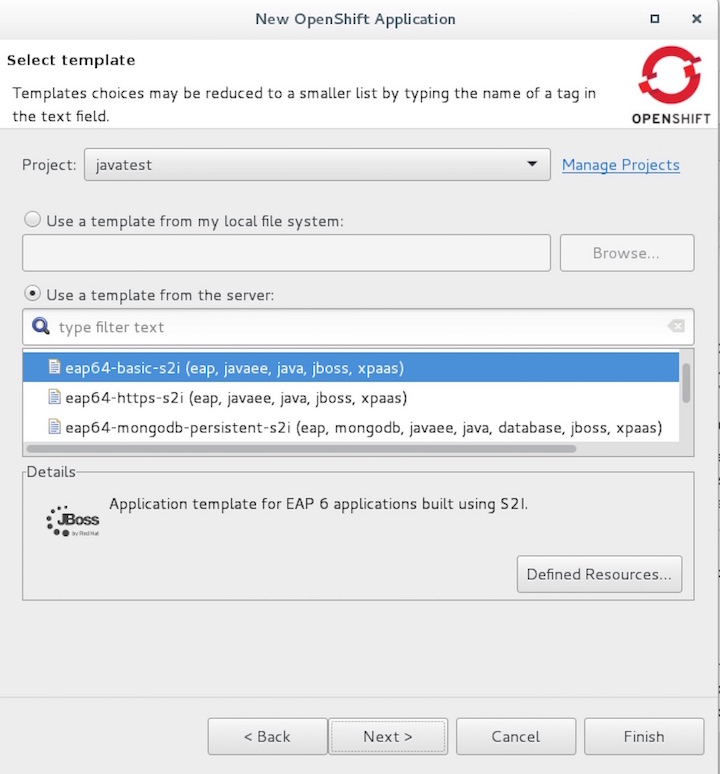

- Select Parameters listed below and enter the values
	- APPLICATION_DOMAIN:mytestapp-javatest-Username.apps.osecloud.com 
	- APPLICATION_NAME:mytestapp
	- CONTEXT_DIR:<empty>
	- SOURCE_REPOSITORY_REF: <empty> 
	- SOURCE_REPOSITORY_URL:  https://github.com/RedHatWorkshops/kitchensink
- Then, click edit to update the values of the parameters.
- Click ok after update each parameter.
- Click Next after updating all the parameters
- Click Finish.

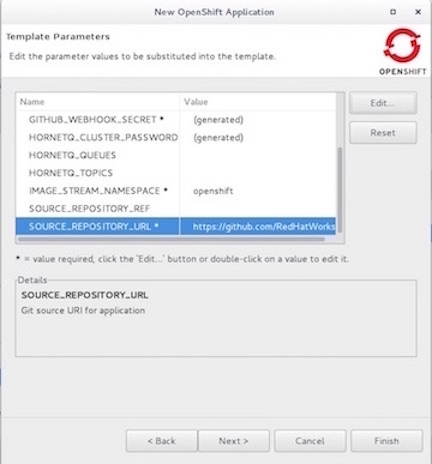

- Click OK

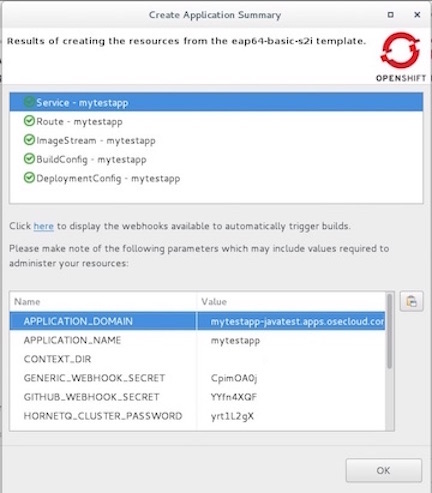

- Click Finish

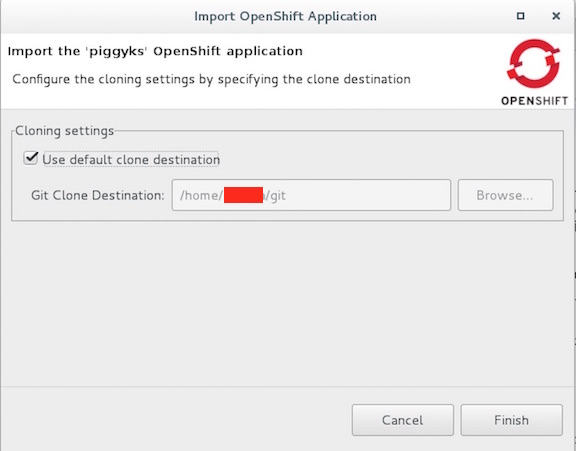

- Review the status under OpenShift Explorer

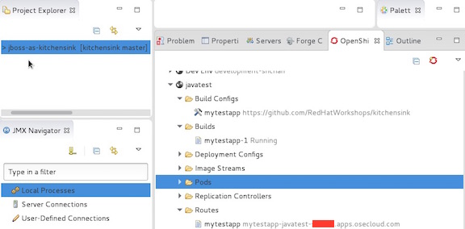

