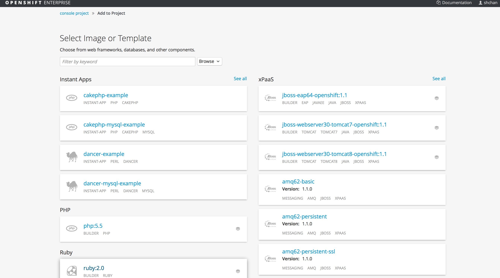
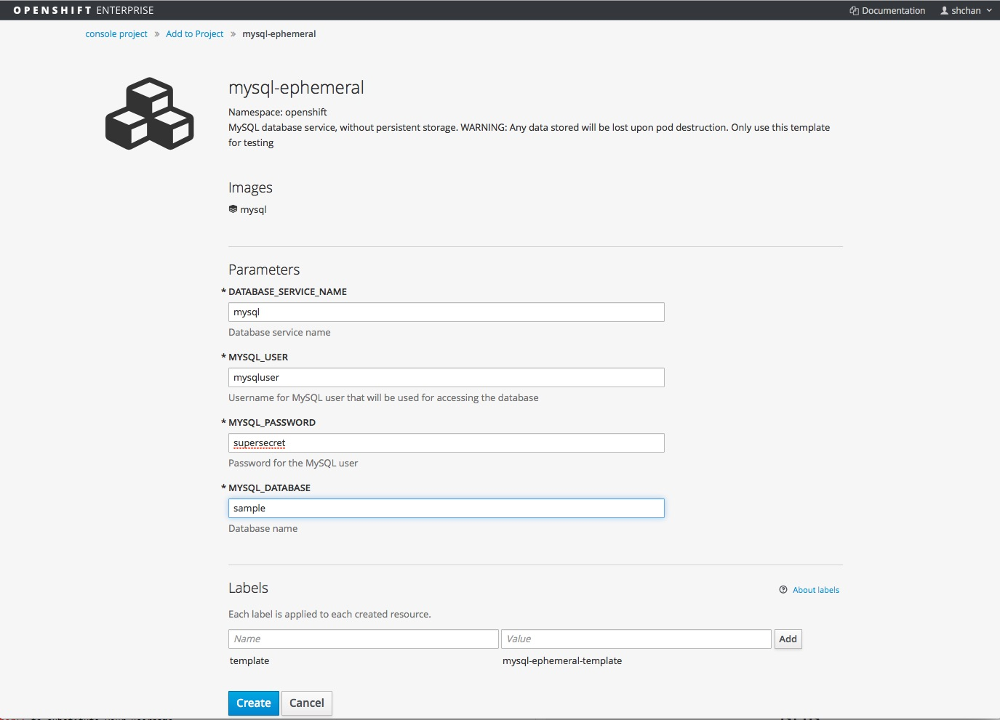
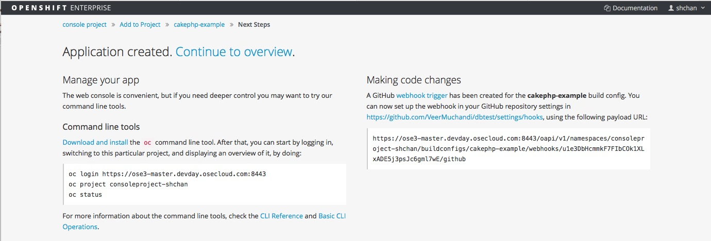
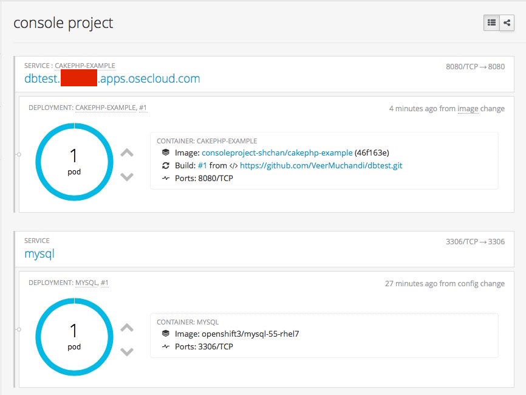

In this lab exercise we will learn to use OpenShift Web Console to spin up a MySQL database using templates. We will then add a frontend PHP application that accesses this database using the service exposed by the database. We will provide a route (a URL) to access the frontend application from a browser.


**Step 1: Create a Project**

Based on the experience gained from the previous exercise, log into the OpenShift Web Console. You will see the list of Projects.

Using the `New Project` Button, create a new project. I am going to call it "consoleproject-UserName". Substitute your username to make this project unique. Type in a `Display Name` and `Description` of your choice. 

Press the `Create` button to complete the project creation from the Web Console. This will accomplish the same job as `oc new-project` from CLI

**Step 2: Create a MYSQL database using the template **

You will be taken to select image or template and looks like below.
You will see the application create screen as shown below:


Scroll down to Databases session, click `See all` to see the list of all the available dabase templates. Select 'mysql-ephemeral' template from the list by click onto the link. You will also notice 'mysql-persistent' template. But we will address that in a different lab exercise.


You will be taken to the mysql ephemeral creation screen. Click edit parameters and edit the values. I am using the values as

* Database Service Name: mysql
* MySQL User: mysqluser
* MySQL Password: supersecret
* MySQL Database: sample

In the next section you can `add` label
* name=name
* value=mysql
my 
Click the `Create` button.



Click `Continue to overview`. 


It will take you back to the project overview page and soon you will see an image of a running pod.


If pod does not show running, Click `Browse` and select `Deployment`, do the following:

- Click onto `mysql` deployments config
- Click on the icon 
- Select Edit from the pop-up screen 
- Search for readinessProbe: and remove the single quotes around $MYSQL_PASSWORD
- Click save
- Click `Browse` and select `Pods`
- Click onto the pod name
- Click on the icon  and select delete


Browse over to Pods, Services and Deployments from the `Browse` tab to notice the additions to the project. You will note that the service has been assigned an IP address that starts with 172.*. Make a note of that. Also note the port that is exposed by this service. By default it exposes 3306.


** Step 3: Add data to MySQL database**

Let us see how we can enter the pod and access the database.

From the command line, change the project to the "consoleproject-UserName" using command
**Remember** to substitute your username

````
 oc project consoleproject-UserName
````
Based on what you learnt previously get the list of running pods (Tip: `oc get pods`). You will find one pod for mysql running. Note its name.


Enter the pod by running the following command. Substitute the podname with your mysql pod name.

```` 
$ oc rsh mysql-1-aewve
bash-4.2$

````

You will be taken to a bash prompt inside the running pod. Now using the service ip address you noted earlier, port number, username and password you used start the mysql client as shown below. You will have to substitute your values here.
 
*Tip:* If you need service ip address navigate to `Browse->Services` tab on the Web Console. 

````
mysql -h172.30.5.210 -P3306 -umysqluser -psupersecret
````

You will be taken to the `mysql` prompt. See the list of databases. You will notice that the sample database that you requested is added and available.

````
show databases;
````
Change over to use the `sample` database.
````
use sample;
````

Now `show tables` shows an empty set. So let us create a table and add some records using the commands shown below.


````
create table users (user_id int not null auto_increment, username varchar(200),PRIMARY KEY(user_id));
````

````
insert into users values (null, 'joe');
insert into users values (null, 'alice');
````

Verify that the records you added are there 

````
select * from users;
````

Now `exit` MySQL client and `exit` out of the pod.


**Step 4: Add a PHP frontend to talk to this database **

In this step we will add a PHP frontend application that talks to recently create database. The code is available on github to use at "https://github.com/VeerMuchandi/dbtest". 

Browse through the code in this repository. It has a simple php file (dbtest.php) that connects to the database and reads the values from the users table and displays them.

To add a frontend again press on `Add to Project` to spin up a frontend application in the same 'consoleproject'. It takes you to select image or template page and choose the "cakephp-example" template under instant apps.


You will be taken to the screen where you can edit the template defaults like before. Enter the following values for each parameters:

* Source control repository URL: https://github.com/VeerMuchandi/dbtest.git
* Application domain name: dbtest.UserName.apps.osecloud.com **Remember** to substitute username
* Database Service Name: mysql (this should match the service name for database created earlier)
* Database Engine: mysql
* Database Name: sample
* Database User: mysqluser (the value we set earlier)
* Database Password: supersecret (the value we set earlier)

In the next section add a label 
* name=name
* value=dbtest

Click `Create` to add this frontend application to talk to the database.



Click `Continue to overview`

You will be taken back to the Project Overview page and you will start seeing that a new service is now available. 


You will also notice that a build starts running very soon. Once the build completes, the application image created from the source code will be uploaded to the docker repository. 



You can check the build logs using the following commands.

````
$ oc build-logs cakephp-example-1 
or 
$ oc logs build/cakephp-example-1
````
Once the build completes, OpenShift initiates a deploy process. Once the deployment is complete, the frontend pod starts running. You will find the running pod when you navigate to `Browse->Pods` on the Web console.

Now type in your application url in the browser or use curl with
` http://<<your application url>>/dbtest.php`

You will notice that it displays the records read from the database

````
Here is the list of users: 
User Id: 1 User Name: joe
User Id: 2 User Name: alice
End of the list 

````

In this lab exercise you have seen a complete web application deployed using OpenShift templates in two parts.
First we deployed the MySQL database. We added data manually by getting into the pod.
Then we added the frontend code that was built using the OpenShift S2I process.
You configured this frontend application to access the database using a service, in this case, the "mysql" service.
The frontend is made accessible using a route for which you gave a URL.


