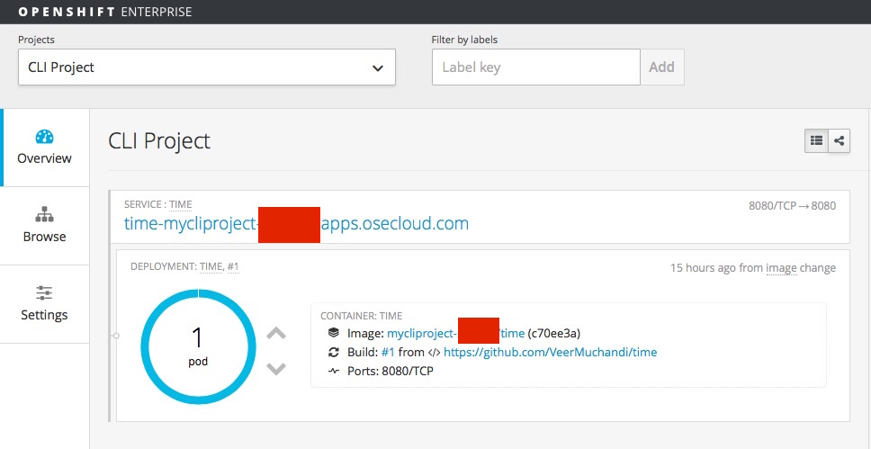
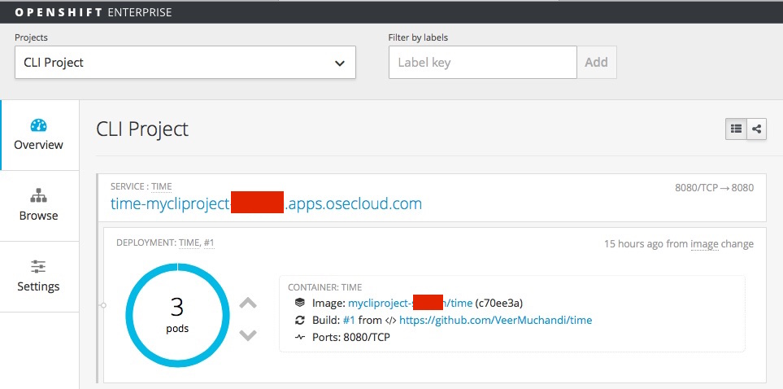

In this exercise we will learn how to scale our application. OpenShift has the capability to scale your application and make sure that many instances are always running.

**Step 1: Switch to an existing project**

For this exercise, we will be using an already running application. We will be using the `mycliproject-UserName` that you created in the previous labs. Make sure you are switched to that project by using the `oc project` command. **Remember** to substitute UserName

```
$ oc project mycliproject-UserName
```

**Step 2: View the deployment config**

Take a look at the `deploymentConfig` (or `dc`) of the `time` application

```
$ oc get deploymentConfig/time -o yaml
apiVersion: v1
kind: DeploymentConfig
metadata:
  annotations:
    openshift.io/generated-by: OpenShiftNewApp
  creationTimestamp: 2015-12-22T02:41:51Z
  labels:
    app: time
  name: time
  namespace: mycliproject-shchan
  resourceVersion: "2897731"
  selfLink: /oapi/v1/namespaces/mycliproject-shchan/deploymentconfigs/time
  uid: 8dfe730e-a855-11e5-be21-fa163ec58dad
spec:
  replicas: 1
  selector:
    app: time
    deploymentconfig: time
  strategy:
    resources: {}
    rollingParams:
      intervalSeconds: 1
      maxSurge: 25%
      maxUnavailable: 25%
      timeoutSeconds: 600
      updatePeriodSeconds: 1
    type: Rolling
  template:
    metadata:
      annotations:
        openshift.io/generated-by: OpenShiftNewApp
      creationTimestamp: null
      labels:
        app: time
        deploymentconfig: time
    spec:
      containers:
      - image: 172.30.47.239:5000/mycliproject-shchan/time@sha256:c70ee3ae572b64efce1df256be1574edcebd314d8c721cf205ea9120b63ff4da
        imagePullPolicy: Always
        name: time
        ports:
        - containerPort: 8080
          protocol: TCP
        resources: {}
        terminationMessagePath: /dev/termination-log
      dnsPolicy: ClusterFirst
      restartPolicy: Always
      securityContext: {}
      terminationGracePeriodSeconds: 30
  triggers:
  - type: ConfigChange
  - imageChangeParams:
      automatic: true
      containerNames:
      - time
      from:
        kind: ImageStreamTag
        name: time:latest
      lastTriggeredImage: 172.30.47.239:5000/mycliproject-shchan/time@sha256:c70ee3ae572b64efce1df256be1574edcebd314d8c721cf205ea9120b63ff4da
    type: ImageChange
status:
  details:
    causes:
    - imageTrigger:
        from:
          kind: DockerImage
          name: 172.30.47.239:5000/mycliproject-shchan/time:latest
      type: ImageChange
  latestVersion: 1
```

Note that the `replicas:` is set to `1`. This tells OpenShift that when this application deploys, make sure that there is 1 instance. 

The `replicationController` mirrors this configuration initially; the `replicationController` (or `rc`) will ensure that there is always the set number of instances always running.

To view the `rc` for your application first get the current pod running

```
oc get pods
NAME           READY     REASON       RESTARTS   AGE
time-1-build   0/1       ExitCode:0   0          34m
time-1-s64qd   1/1       Running      0          26m
```

This shows that the build `time-2` is running in pod `s64qd`. Let us view the `rc` on this build

```
$ oc get rc/time-1
CONTROLLER   CONTAINER(S)   IMAGE(S)                                                                                               SELECTOR                                  REPLICAS
time-1       time           172.30.246.7:5000/myphp/time@sha256:48c9c9af3f3e42fda5c56cfcbeb1cc81c2080ae6c4dd79c4b32d1af5e3342392   deployment=time-2,deploymentconfig=time   1
```
**Note:** You can change the number of replicas in DeploymentConfig or the ReplicationController. 

However note that if you change the `deploymentConfig` it applies to your application. This means, even if you delete the current replication controller, the new one that gets created will be assigned the REPLICAS value based on what is set for DC. If you change it on the Replication Controller, the application will scale up. But if you happen to delete the current replication controller for some reason, you will loose that setting.


**Step 3: Scale Application**

To scale your application we will edit the `deploymentConfig` to 3.

First; open your brower to the Overview page and note you only have one instance running.


Now scale your application using the `oc scale` command (remembering to specify the `dc`)

```
$ oc scale --replicas=3 dc/time
deploymentconfig "time" scaled
```

If you look at the web console and you will see that there are 3 instances running now


**Note** that you can also scale up and down from the web console by going to the project overview page and clicking twice on  right next to the pod count circle to add 2 more pods.


On the command line, see how many pods you are running now

```
$ oc get pods
NAME           READY     REASON       RESTARTS   AGE
time-1-build   0/1       ExitCode:0   0          49m
time-1-a1ufp   1/1       Running      0          3m
time-1-rp9sn   1/1       Running      0          3m
time-1-s64qd   1/1       Running      0          41m
```

You now have 3 instances of `time-1` running (each with a different pod-id)

If you check the `rc` of the `time-1` build you will see that it has been updated by the `dc`.

```
$ oc get rc/time-1
CONTROLLER   CONTAINER(S)   IMAGE(S)                                                                                               SELECTOR                                  REPLICAS
time-1       time           172.30.246.7:5000/myphp/time@sha256:48c9c9af3f3e42fda5c56cfcbeb1cc81c2080ae6c4dd79c4b32d1af5e3342392   deployment=time-2,deploymentconfig=time   3
```

**Step 4: Scaling Down**

Scaling down is the same procedure as scaling up. Use the `oc scale` command on the time `dc` setting.

```
oc scale --replicas=1 dc/time
deploymentconfig "time" scaled
```
Alternately, you can go to project overview page and click on  twice to remove 2 running pods.

Congratulations!! In this exercise you have learned about scaling and how to scale up/down your application on OpenShift!

