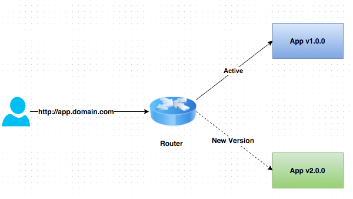
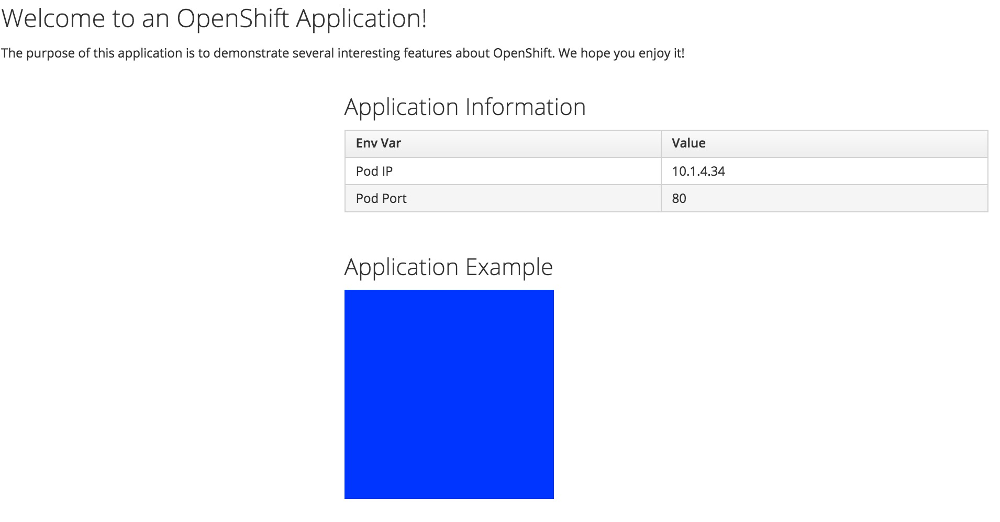
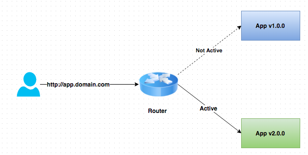

## Blue-Green Deployments

The purpose of this short lab is to demonstrate how simple it is to implement
Blue-Green Deployments in OpenShift v3.

"*Blue-green deployment is a release strategy that can be utilized by developers
for deploying software in a production environment. Blue can be one particular
production environment whereas green can define an identical production
environment. Under blue-green deployment strategy, software developers are able
to minimize downtime and reduce risk.*" [1*](https://en.wikipedia.org/wiki/User:Nuqing/Blue-green_deployment)

In this Lab, we will be:

- Deploying two versions of the same application. The first version will display a blue rectangle.
- Create a FQDN that can be used to expose the applications.
- We will first expose the first application.
- We will also create another version of this application in the same project that displays a green rectangle.
- We will then switch the FQDN to from the first application (blue) to the second application (green).



### Part I

**Step 1: Create a new project**

**Remember** to substitute the username

```
$ oc new-project bluegreen-UserName --display-name="Blue Green Project" --description="Blue Green Project"
```

**Step 2: List existing image builder or image streams**

```
$ oc new-app -S --image-stream=php

Image streams (oc new-app --image-stream=<image-stream> [--code=<source>])
-----
php
  Project: openshift
  Tags:    5.5, 5.6, latest
```

**Step 3: Create an application**

We will be using a sample application that displays a blue or green rectangle.
The sample app can be browsed in https://github.com/VeerMuchandi/bluegreen.git.
The important file and where the small change will take place is:
https://github.com/VeerMuchandi/bluegreen/blob/master/image.php.

Please fork this github repo `https://github.com/VeerMuchandi/bluegreen.git` into your own github. In the command below, **substitute the github url with your own and check the** `imagefilledrectangle` **should be set to blue in image.php**.

```
$ oc new-app --image-stream=php --code=https://github.com/your_github_username/bluegreen.git --name=blue
```

**Step 4: Monitor the application build**

```
$ oc get builds

NAME      TYPE      FROM          STATUS     STARTED              DURATION
blue-1    Source    Git@afdc492   Complete   About a minute ago   1m8s
```

Using the build name of the recently created application run:

```
$ oc logs build/blue-1
```

Once the build finishes you should see something similar to:

```
...
---> Installing application source...


Pushing image 172.30.89.28:5000/bluegreen-admin/blue:latest ...
Pushed 0/5 layers, 2% complete
Pushed 1/5 layers, 24% complete
Pushed 2/5 layers, 46% complete
Pushed 3/5 layers, 68% complete
Pushed 3/5 layers, 100% complete
Pushed 4/5 layers, 100% complete
Pushed 5/5 layers, 100% complete
Push successful

```

**Step 5: Check application deployment status**

```
$ oc get pods

NAME           READY     STATUS       RESTARTS   AGE
blue-1-build   0/1       Completed    0          4m
blue-1-ruyrt   1/1       Running      0          19s
```

Notice that the build pod has exited and you now have a single instance of the
application running under one single pod.

**Step 6: List the service**

```
$ oc get service
```

**Step 7: Create a route for the application**

**Remember** to substitute the username. Expose the service:

```
$ oc expose service blue --hostname=bluegreen.UserName..<<DomainNameSuffix>> --name=bluegreen
```

**Step 8: Test the application**

```
$ oc get route
```

Copy the HOST/PORT and paste it in your browser. You should see something similar
to:



At this point you have deployed an application that displays for illustration
purposes a blue rectangle for version 1.

## Part II

In this part, we will:

- Deploy a new version of this application (Same one as before with a very small change)

- Point the previously created FQDN (route) to the new service that will be created
as part of the new application creation process.




**Step 1: Create new version of the application**

Edit the following file in your forked repo:

https://github.com/your_github_username/bluegreen/blob/master/image.php

Comment line that creates blue rectangle and uncomment the line that creates green rectangle as below

````
// Draw a filled rectangle
//imagefilledrectangle($im, 0, 0, 199, 199, $blue);
imagefilledrectangle($im, 0, 0, 199, 199, $green);

````

Save/Commit the file.

**Step 2: Deploy the new version of the application**

Repeat steps 3 through 6 from Part I. Make sure to name the application as 'green'
this time.

````
$ oc new-app --image-stream=php --code=https://github.com/your_github_username/bluegreen.git --name=green
````

- Wait until the application is built and deployed. You should now see two services if you run:

```
$ oc get service

NAME      CLUSTER-IP       EXTERNAL-IP   PORT(S)    AGE
blue      172.30.2.161     <none>        8080/TCP   24m
green     172.30.136.184   <none>        8080/TCP   1m
```

- Edit the previously created route and change the `service` name (from `blue` to `green`), all the way at the bottom to the new service that was just created. You are essentially still using the FQDN you had previously created. However, that route will now point to a different (green) service.

```
$ oc edit route bluegreen

apiVersion: v1
kind: Route
metadata:
  creationTimestamp: 2015-12-22T19:16:28Z
  labels:
    app: green
  name: bluegreen
  namespace: bluegreen-UserName
  resourceVersion: "2969408"
  selfLink: /oapi/v1/namespaces/bluegreen-UserName/routes/bluegreen
  uid: 80829b59-a8e0-11e5-be21-fa163ec58dad
spec:
  host: bluegreen.UserName.apps.osecloud.com
  port:
    targetPort: "8080"
  to:
    kind: Service
    name: green
status: {}
```

**Step 3: Test the application**

```
$ oc get route
```

- Copy the HOST/PORT and paste it in your browser.

- You should now see the new version of the recently deployed application with a green rectangle.

## Summary

- Blue-Green deployments can be easily accomplished in OpenShift v3.

- We have shown multiple versions of an application; all running concurrently,
each with a unique service.

- All that is needed to expose any of the applications is to change the service
being used by the route to publicly advertise the application.
